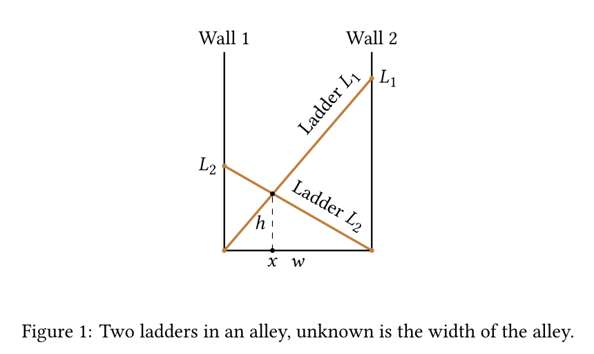

# Programming Assignment 1 - Solving quartic equation by formula

## The Modified Two-Ladder Problem

Two buildings are separated by an alley. Two ladders are placed so
that the base of each ladder is against one of the buildings and
reaches the top of the other building. The two ladders are `L1 = 40
ft` and `L2 = 30 ft` long. They cross at a point `h = 10 ft` above the
ground. How wide is the alley (find `w`)?

Diagram (not to scale):

Legend and coordinates:
- Left wall is at `x = 0`, ground at `y = 0`.
- Right wall is at `x = w`.
- Ladder `L1` runs from `(0,0)` to `(w, y1)` and has length `L1 = 40`.
- Ladder `L2` runs from `(w,0)` to `(0, y2)` and has length `L2 = 30`.
- The ladders cross at `(x, h)` where `h = 10`.
- Unknown: the alley width `w`.

(You may use these coordinates and lengths to set up the geometric equations to solve for `w`.)

## Background

This problem is described in detail in Chapter 3x of the 'numbook'.
Also, Exercise 3.23 and its solution in the Appendix R provide some hints.

## The approach you must follow

  * Derive an algebraic equation which `w` must satify (e.g., quadratic, cubic,
  quartic). The 'numbook' explains how to do this, eventually reducing
  the problem to the following equation: `1/\sqrt(a-x) + 1/sqrt(b-x) = 1`.
  Exercise 3.23 and its solution contain the quartic equation which
  `x` satisfies.
  
  * Implement a solver for algebraic equations of the type you derived,
  Covering linear, quadratic, cubic and quartic equations.

  * Your solver must not use iteration, and must not use radicals.
  Instead, it must use trigonometric or hyperbolic function substitution.
  
  * **Example**: There is a trigonometric identity:
  `cos(alpha) = 2*cos(alpha)**2-1` allows one to solve all quadratic
  equations. First, we transform the equation to the form
  `2*y**2-1=c` and then use the substitution `y=cos(alpha)`. Thus
  `cos(2*alpha)=c`. Then `2*alpha=acos(c) + 2*pi*k`, `k=0,1`, and we find `alpha`.
  This works if `|c|<1`. For `|c|>1` we use hyperbolic
  functions. The identity is `cosh(2*u) = 2*cosh(u)**2-1`.
  After all, `cosh` and `cos` are the same function, subject to
  imaginary rotation.

  * Reduce a quartic equation to a cubic by constructing the
  "resolvent cubic". See the article [Resolvent  cubic](https://en.wikipedia.org/wiki/Resolvent_cubic) on Wikipedia.

  * Create a test suite for the solve which will run by running `pytest`
  in the top folder of the repository.
  
## Startup code

  * Files [cubic_solver.py](cubic_solver.py) and
  [quartic_solver.py](quartic_solver.py) containing the signatures and
  rudimentary code for the tasks at hand.
  
  
## Requirements

  * You must expand the code in [quartic_solver.py](quartic_solver.py) 
  so that it solves algebraic equations up to degree 4, with lower degrees
  covered as degenerate cases.
  
  * If there are multiple roots, they should appear repeated.
  
  * Complex roots must be handled. By the nature of the algorithm, no
  "imaginary noise" must not occur when it can be shown by machine
  arithmetic that the roots are real.
  
## Submission

  * Gradescope assignment 'Programming Assignment 1' was 
  created to accept your submission. Use your favorite "avatar" name
  for the Leaderboard!
  
  * Your submission should be a submission of a complete
  GitHub or another repository supported  by Gradescope. Do not
  submit individual files or Zip archive of your repository.

  * As the first step you should clone this repository.
  * You must provide unit tests

## Grading
  * Grades will be assigned by an autograder
  * Your quartic equation solver will be tested on various
  examples of quartic and cubic equations.

## About the autograder platform

  * Your code will run in a virtual machine running Ubuntu 22.04 operating
  system, with a limited Python installation. Thus, only some Python packages
  will be available (math, cmath)
  * The machine will have 0.5 CPU, 0.75GB RAM
  * The time limit is 10 minutes
